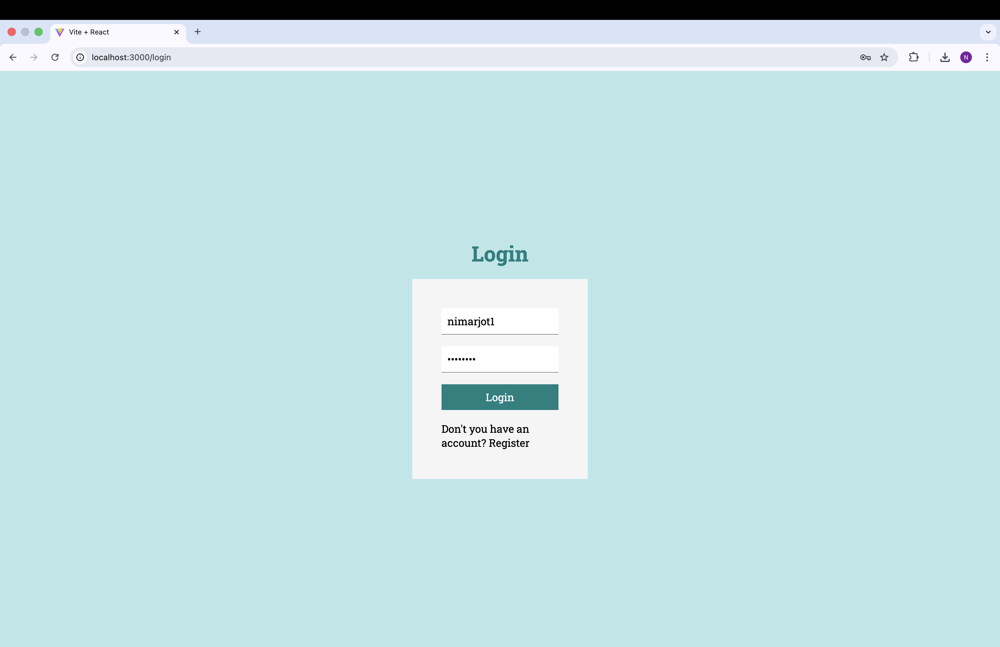
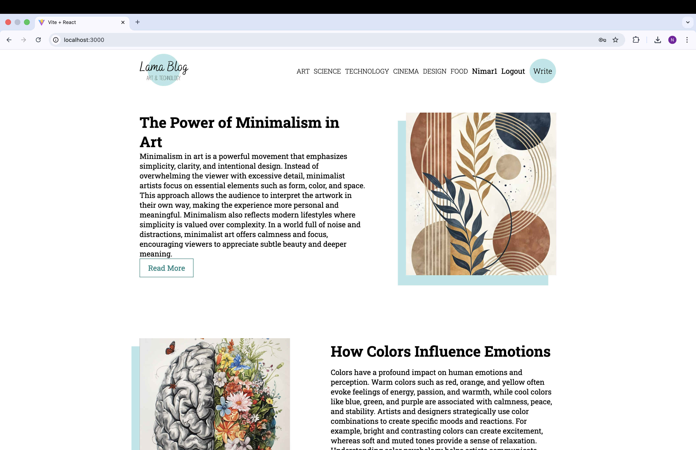
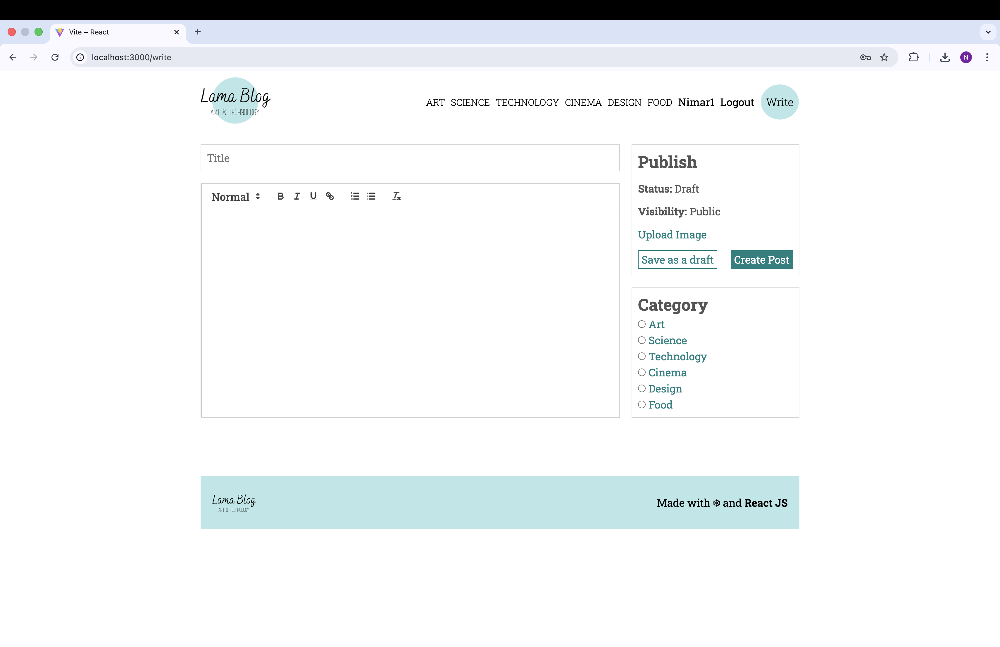
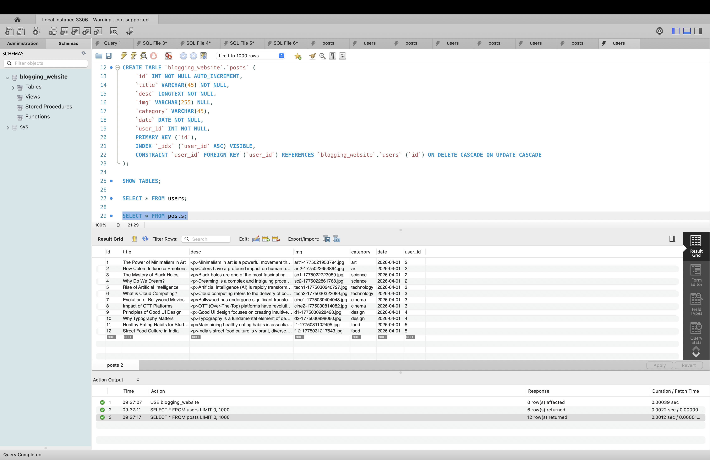

# 📝 Blog Project (Full Stack Blogging Platform)

A modern **full-stack blogging application** built using **React, Node.js, Express, and MySQL**.  
This platform allows users to create, manage, and explore blogs with authentication, categories, and image uploads.

---

## 🚀 Features

- 🔐 User Authentication (JWT-based Login & Register)
- 📝 Create, Edit, Delete Blog Posts (CRUD)
- 📂 Category-based Blogs (Art, Science, Technology, Cinema, Design, Food)
- 🖼️ Image Upload Support using Multer
- ✍️ Rich Text Editor for blog writing
- 🔎 Filter posts by category
- ⚡ Fast UI built with React (Vite)
- 🔄 RESTful APIs with Express.js
- 🗄️ MySQL Database with relational schema

---

## 🖥️ Screenshots

### 🔐 Login Page

### 🏠 Home Page

### ✍️ Write Blog Page

### 🗄️ Database (MySQL)

---

## 🛠️ Tech Stack

### Frontend
- React.js (Vite)
- CSS / SCSS

### Backend
- Node.js
- Express.js

### Database
- MySQL

### Tools & Libraries
- JWT (Authentication)
- Multer (File Upload)
- Axios (API Requests)

---

